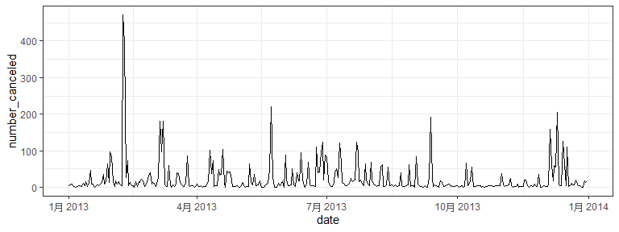
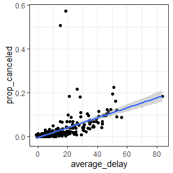

README
================
Xinkai Shen
9/25/2022

Here we directly import the `tidyverse` package, because it integrates a
series of data processing R packages including `dplyr`, `ggplot` and so
on.

``` r
library(tidyverse)
```

    ## Warning: package 'tidyverse' was built under R version 4.0.5

    ## Warning: package 'ggplot2' was built under R version 4.0.5

    ## Warning: package 'tibble' was built under R version 4.0.5

    ## Warning: package 'tidyr' was built under R version 4.0.5

    ## Warning: package 'readr' was built under R version 4.0.5

    ## Warning: package 'purrr' was built under R version 4.0.5

    ## Warning: package 'dplyr' was built under R version 4.0.5

    ## Warning: package 'stringr' was built under R version 4.0.5

    ## Warning: package 'forcats' was built under R version 4.0.5

``` r
library(nycflights13)
```

    ## Warning: package 'nycflights13' was built under R version 4.0.5

## Q1

We first filter out the rows with dep_time of na, and then count their
rows afterwards, resulting in 8255 rows of data with dep_time of missing
value.

``` r
df = nycflights13::flights

dep_time_na_df = df %>%
  filter(is.na(dep_time)) 
dep_time_na_df %>%
  nrow()
```

    ## [1] 8255

We continue to select the columns containing NA values and filter the
results as follows

``` r
dep_time_na_df %>%
  select_if(
    function(x){
      sum(is.na(x)) != 0
    }
  ) %>%
  head(10) %>%
  knitr::kable(format = "simple")
```

| dep_time | dep_delay | arr_time | arr_delay | tailnum | air_time |
|---------:|----------:|---------:|----------:|:--------|---------:|
|       NA |        NA |       NA |        NA | N18120  |       NA |
|       NA |        NA |       NA |        NA | N3EHAA  |       NA |
|       NA |        NA |       NA |        NA | N3EVAA  |       NA |
|       NA |        NA |       NA |        NA | N618JB  |       NA |
|       NA |        NA |       NA |        NA | N10575  |       NA |
|       NA |        NA |       NA |        NA | N13949  |       NA |
|       NA |        NA |       NA |        NA | N10575  |       NA |
|       NA |        NA |       NA |        NA | N759EV  |       NA |
|       NA |        NA |       NA |        NA | N13550  |       NA |
|       NA |        NA |       NA |        NA | NA      |       NA |

It can be seen that basically all of them are related to time, I think
these flights may have been cancelled, so no data is available.

## Q2

We first use the str_c function to extract the hours and minutes of the
time, and later convert them to minutes from midnight by calculation.

``` r
df = df %>%
  mutate(
    dep_hour = str_sub(dep_time, 0, -3) %>% as.integer(),
    dep_min = str_sub(dep_time, -2, -1) %>% as.integer(),
    sched_dep_time_hour = str_sub(sched_dep_time, 0, -3) %>% as.integer(),
    sched_dep_time_min = str_sub(sched_dep_time, -2, -1) %>% as.integer(),
  ) %>%
  mutate(
    dep_time_new = 60*dep_hour + dep_min,
    sched_dep_time_new = 60*sched_dep_time_hour + sched_dep_time_min
  )
```

The result is as follows, you can see that the conversion has been
successfully completed

``` r
df %>%
  select(dep_time, dep_time_new, sched_dep_time, sched_dep_time_new) %>%
  head() %>%
  knitr::kable(format="simple")
```

| dep_time | dep_time_new | sched_dep_time | sched_dep_time_new |
|---------:|-------------:|---------------:|-------------------:|
|      517 |          317 |            515 |                315 |
|      533 |          333 |            529 |                329 |
|      542 |          342 |            540 |                340 |
|      544 |          344 |            545 |                345 |
|      554 |          354 |            600 |                360 |
|      554 |          354 |            558 |                358 |

## Q3

We first use the `lubridate` package to process the dates, while we use
all samples with `dep_time` of NA as the samples whose flights were
cancelled.

``` r
library(lubridate)
```

    ## Warning: package 'lubridate' was built under R version 4.0.5

``` r
df %>%
  mutate(
    is_canceled = is.na(dep_time),
    date = ymd(str_c(year, "-", month, "-", day))
  ) %>%
  group_by(date) %>%
  summarise(
    number_canceled = sum(is_canceled)
  ) %>%
  ggplot(
    aes(x=date, y=number_canceled)
  ) +
  geom_line() +
  theme_bw()
```



It can be seen that there is a clear cycle and regularity, for example,
in the rainy season of July-August, the number of flight cancellations
is higher, and in September-November, when the weather is better and
there is less rain, the number of flight cancellations is lower.

We continue to focus on the relationship between the percentage of
flight cancellations and the average delay time of flights by plotting a
scatter plot of the two and a regression fitted line as follows.

``` r
df %>%
  mutate(
    is_canceled = is.na(dep_time),
    date = ymd(str_c(year, "-", month, "-", day))
  ) %>%
  group_by(date) %>%
  summarise(
    prop_canceled = sum(is_canceled)/n(),
    average_delay = mean(dep_delay, na.rm = T)
  ) %>%
  ggplot(aes(x=average_delay, prop_canceled)) +
  geom_point() +
  geom_smooth(method = 'lm') +
  theme_bw()
```



You can see that there is a strong linear relationship between the two.
In fact it is very easy to understand that if the flight delays are very
long on that day, which means that the weather conditions are probably
very bad on that day, then the percentage of flight cancellations will
naturally increase.
